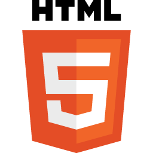
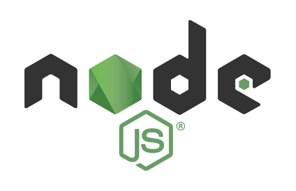
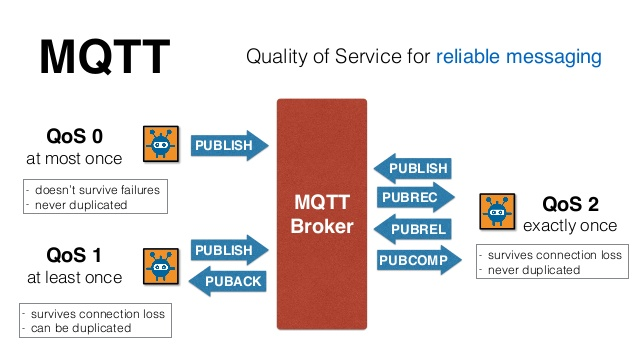

title: Remote Pad

Imagine poder controlar um jogo em seu computador usando seu smartphone
como gamepad?

---

title: Arquitetura

---

title: Agenda

Tópicos:

* **html5** - events, hardware access
* **nodejs** - event driven, assynchronous I/O
* **mqtt** - real time communication
* **robotjs** - envios de tecla através de software
* **vuejs** - unobtrusive reactivity system

---

content_class: flexbox vcenter

---

title: Device Orientation Events

Eventos no DOM para obter informações sobre a orientação e movimentação
física do dispositivo móvel.

* Giroscópio
* Acelerômetro
* Compasso

---

title: Device Orientation Events

Eventos:

* `deviceorientation`
* `devicemotion` &#10003;
* `compassneedscalibration`

---

title: Outras APIs

* Ambient Light API
* Geolocation API
* Battery Status API
* getUserMedia API
* Vibration API
* Web Notification API
* Web Speech API

---

content_class: flexbox vcenter

---

title: NodeJS

NodeJS usa um modelo orientado a eventos, com E/S não bloqueante que o torna
leve e eficiente.

Como o Javascript é restrito ao browser foi necessário criar outros
módulos como:

* Buffer
* Child Process
* File System
* OS
* Stream, etc.

---

title: NodeJS

Node é projetado para construir aplicações escaláveis de rede. A seguir um exemplo
de servidor que pode atender a várias conexões concorrentemente:

<pre class="prettyprint" data-lang="js">
const http = require('http')

const hostname = '127.0.0.1'
const port = 3000

const server = http.createServer((req, res) => {
  res.statusCode = 200
  res.setHeader('Content-Type', 'text/plain')
  res.end('Hello World\n')
})

server.listen(port, hostname, () => {
  console.log(`Server running at http://${hostname}:${port}/`)
})
</pre>

---

title: Benchmark
content_class: flexbox vcenter

`$ pm2 start index.js`

---

title: Benchmark
content_class: flexbox vcenter

`$ locust --host=http://localhost:3003`

---

title: NodeJS Event Loop
content_class: flexbox vcenter

---

title: NodeJS Event Loop
content_class: flexbox vcenter

---

title: NodeJS Event Loop

Visualizing the javascript runtime at runtime

<http://latentflip.com/loupe>

---

content_class: flexbox vcenter

---

title: RobotJS
subtitle: Exemplo

<pre class="prettyprint" data-lang="js">
var robot = require('robotjs')
// Press enter.
robot.keyTap('enter')
// hold the shift key
robot.keyToggle('shift', 'down')
</pre>

---

title: RobotJS

Usa `node-gyp` ou Node.js native addon build tool

Ferramenta de linha de comando _cross-plataform_ escrita em NodeJS para
compilação de módulos nativos (C/C++) para NodeJS

Requisição de teclas do teclado é escrita em C/C++ e há um _binding_
para NodeJS

---

content_class: flexbox vcenter

---

title: MQTT
subtitle: MQ Telemetry Transport

É um protocolo de mensagens baseado em **publish**/**subscribe**, extremamente
simples e leve, projetado para redes com pouca banda, alta latência ou não
confiáveis.

Princípios: minimizar o uso da banda de rede e recursos do dispositivo enquanto
tenta maximinizar a confiabilidade e algum grau de garantia de entrega das
mensagens.

Também usado nos chamados **M2M** (Machine-to-machine) ou **Internet of Things**

---

title: Quality of service
content_class: flexbox vcenter

---

title: Mosca
subtitle: MQTT broker as a module

<pre class="prettyprint" data-lang="js">
var mosca = require('mosca')
var settings = {
	port: 1883
}
var server = new mosca.Server(settings)
server.on('published', function(packet, client) {
	console.log('Published', packet.topic, packet.payload)
})
server.on('ready', function setup() {
	console.log('Mosca server is up and running')
})
</pre>

---

title: Mosca
subtitle: Exemplo Cliente

<pre class="prettyprint" data-lang="js">
var mqtt = require('mqtt')
var client = mqtt.connect('mqtt://localhost:1883')

client.on('connect', function() {
    client.subscribe('presence')
    client.publish('presence', 'Hello mqtt')
})

client.on('message', function(topic, message) {
    // message is Buffer
    console.log(message.toString())
    client.end()
})
</pre>

---

class: nobackground fill
image: img/vuejs-logo.jpg

---

title: VueJS

**Progressive Framework** para construção de interfaces de usuário

---

title: VueJS
subtitle: Javascript Object.defineProperty

<pre class="prettyprint" data-lang="js">
function Archiver() {
  var temperature = null, archive = [];

  Object.defineProperty(this, 'temperature', {
    get: function() {
      return temperature;
    },
    set: function(value) {
      temperature = value;
      archive.push({ val: temperature });
    }
  });

  this.getArchive = function() { return archive; };
}
</pre>

---

title: VueJS
subtitle: Javascript Object.defineProperty

<pre class="prettyprint" data-lang="js">
var arc = new Archiver();
arc.temperature;
arc.temperature = 11;
arc.temperature = 13;
arc.getArchive();
// => [{ val: 11 }, { val: 13 }]
</pre>

<!-- TODO: https://vuejs.org/v2/guide/reactivity.html#Change-Detection-Caveats -->

---

title: Referências

* HTML5
	* <http://www.girliemac.com/presentation-slides/html5-mobile-approach/deviceAPIs.html>
	* <https://github.com/AurelioDeRosa/HTML5-API-demos>
* NodeJS
	* <https://strongloop.com/strongblog/node-js-event-loop/>
	* <http://latentflip.com/loupe>
    * <https://strongloop.com/strongblog/node-js-is-faster-than-java/>
* Outras Ferramentas
	* <http://locust.io/>

---

title: Referências

* MQTT
	* <http://mqtt.org/faq>
	* <http://www.ibm.com/developerworks/br/local/websphere/mq_conceitos_melhores_praticas/index1.html>
    * <https://github.com/mcollina/mosca>
* RobotJS
	* <http://robotjs.io/>
    * <https://github.com/nodejs/node-gyp>

---

title: Referências

* VueJS
	* <https://vuejs.org/>
    * <https://vuejs.org/v2/guide/reactivity.html>