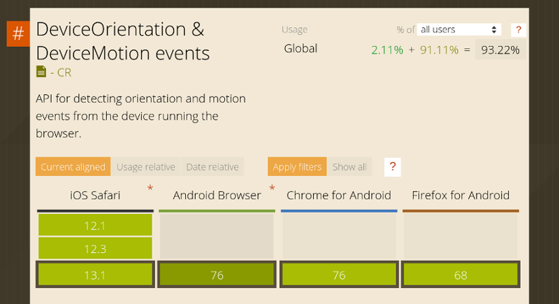
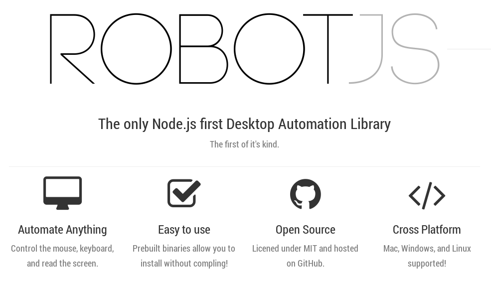
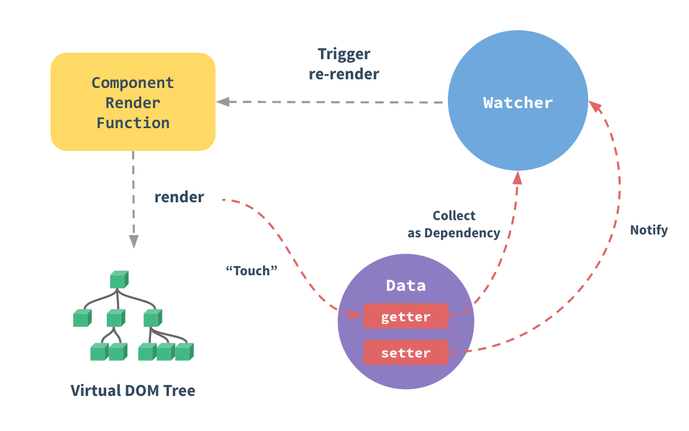

title: Remote Pad

Imagine poder controlar um jogo em seu computador usando seu smartphone
como gamepad?

---

title: Remote Pad - Ideia

---

title: Agenda

* **html5** - events, hardware access
* **nodejs** - event driven, assynchronous I/O
* **mqtt** - real time communication
* **robotjs** - envios de tecla através de software
* **vuejs** - unobtrusive reactivity system

---

content_class: flexbox vcenter

---

title: Device Orientation Events

Eventos no DOM para obter informações sobre a orientação e movimentação
física do dispositivo móvel.

* Giroscópio
* Acelerômetro
* Compasso

---

title: Device Orientation Events

Eventos:

* `deviceorientation`
* `devicemotion` &#10003;
* `compassneedscalibration`

---

title: DeviceMotion suporte

<http://caniuse.com/#feat=deviceorientation>

---

title: Touch Events suporte

<http://caniuse.com/#feat=touch>

---

title: Outras APIs

* Ambient Light API
* Geolocation API
* Battery Status API
* getUserMedia API
* Vibration API
* Web Notification API
* Web Speech API

---

class: segue nobackground fill
image: img/nodejs-segue.png

---

title: NodeJS

NodeJS usa um modelo orientado a eventos, com E/S não bloqueante que o torna
leve e eficiente.

Como o Javascript é restrito ao browser foi necessário criar outros
módulos como:

* Buffer
* Child Process
* File System
* OS
* Stream, etc.

---

title: NodeJS

Node é projetado para construir aplicações escaláveis de rede. A seguir um exemplo
de servidor que pode atender a várias conexões concorrentemente:

<pre class="prettyprint" data-lang="js">
const http = require('http')

const hostname = '127.0.0.1'
const port = 3000

const server = http.createServer((req, res) => {
  res.statusCode = 200
  res.setHeader('Content-Type', 'text/plain')
  res.end('Hello World\n')
})

server.listen(port, hostname, () => {
  console.log(`Server running at http://${hostname}:${port}/`)
})
</pre>

---

title: Benchmark
content_class: flexbox vcenter

`$ pm2 start index.js`

---

title: Benchmark
content_class: flexbox vcenter

`$ locust --host=http://localhost:3003`

---

title: NodeJS Event Loop
content_class: flexbox vcenter

---

title: NodeJS Event Loop

Visualizing the javascript runtime at runtime

<http://latentflip.com/loupe>

---

content_class: flexbox vcenter

---

title: RobotJS
subtitle: Exemplo

<pre class="prettyprint" data-lang="js">
var robot = require('robotjs')

// Press enter.
robot.keyTap('enter')

// hold the shift key
robot.keyToggle('shift', 'down')
</pre>

---

title: RobotJS

Usa `node-gyp` ou Node.js native addon build tool

Ferramenta de linha de comando multi plataforma escrita em NodeJS para
compilação de módulos nativos (C/C++) para NodeJS

Requisição de teclas do teclado é escrita em C/C++ e há um _binding_
para NodeJS

---

class: segue nobackground fill
image: img/mqttorg-segue.png

---

title: MQTT
subtitle: Message Queue Telemetry Transport

É um protocolo de mensagens baseado em **publish**/**subscribe**, extremamente
simples e leve, projetado para redes com pouca banda, alta latência ou não
confiáveis.

Princípios: minimizar o uso da banda de rede e recursos do dispositivo enquanto
tenta maximinizar a confiabilidade e oferecer algum grau de garantia de entrega das
mensagens.

Também usado nos chamados **M2M** (Machine-to-machine) ou **Internet of Things**

---

title: Quality of service
content_class: flexbox vcenter

---

title: Mosca
subtitle: MQTT broker as a module

<pre class="prettyprint" data-lang="js">
var mosca = require('mosca')
var settings = {
	port: 1883
}
var server = new mosca.Server(settings)
server.on('published', function(packet, client) {
	console.log('Published', packet.topic, packet.payload)
})
server.on('ready', function setup() {
	console.log('Mosca server is up and running')
})
</pre>

---

title: Mosca
subtitle: Exemplo Cliente

<pre class="prettyprint" data-lang="js">
var mqtt = require('mqtt')
var client = mqtt.connect('mqtt://localhost:1883')

client.on('connect', function() {
    client.subscribe('presence')
    client.publish('presence', 'Hello mqtt')
})

client.on('message', function(topic, message) {
    // message is Buffer
    console.log(message.toString())
    client.end()
})
</pre>

---

title: MQTT no browser

Utiliza WebSockets para a conexão

	<input id="mqtt_message"/>
    <button id="mqtt_send">Send</button>
    <button id="mqtt_close">Close</button>
    

<https://developer.mozilla.org/en-US/docs/Web/API/WebSockets_API>

---

title: MQTT no browser

<pre class="prettyprint" data-lang="js">
var btnSend = document.getElementById('mqtt_send')
var message = document.getElementById('mqtt_message')
var result = document.getElementById('mqtt_result')
var client = mqtt.connect('ws://test.mosquitto.org:8080/mqtt')
client.subscribe('mqtt/demo')

client.on('message', function(topic, payload) {
	result.innerHTML = [topic, payload].join(': ')
})

btnSend.onclick = function (e) {
	e.preventDefault()
	client.publish('mqtt/demo', message.value)
}
</pre>

<https://github.com/mqttjs/MQTT.js#browser>

---

title: WebSockets suporte

<http://caniuse.com/#feat=websockets>

---

class: segue nobackground fill
image: img/vuejs-logo.jpg

---

title: VueJS

**Progressive Framework** para construção de interfaces de usuário

---

title: Reactive System

Trecho para inicialização da variável que indica mudanças no eixo **Y**:

<pre class="prettyprint" data-lang="js">
export default {
	data () {
    	<b>acceleration: {
        	y: 0
        }</b>
    },
	mounted () {
    	if (window.DeviceMotionEvent !== undefined) {
            window.ondevicemotion = (e) => {
                <b>this.acceleration.y = e.accelerationIncludingGravity.y || 0</b>
            }
        }
    }
}
</pre>

---

title: Reactive System

Trecho para indicar que o usuário está virando para a esquerda ou direita:

<pre class="prettyprint" data-lang="js">
export default {
	computed: {
        isTurningLeft () {
            const { accelerationSensibility } = this.$store.state
            this.keypress.left =
            	<b>this.acceleration.y < accelerationSensibility * -1</b>
            return this.keypress.left
        },
        isTurningRight () {
            const { accelerationSensibility } = this.$store.state
            this.keypress.right =
            	<b>this.acceleration.y > accelerationSensibility</b>
            return this.keypress.right
        }
    }
}
</pre>

---

title: Remote Pad
class: segue nobackground fill
image: img/remote-pad-gui-services.png

---

title: Remote Pad

Cliente: <https://github.com/comsolid/remote-pad>

Servidor: <https://github.com/comsolid/remote-pad-server>

GUI (Interface Gráfica): <https://github.com/comsolid/remote-pad-gui>

---

title: Remote Pad
subtitle: Protocolo de envio de comandos - Cliente

<pre class="prettyprint" data-lang="json">
{
    "keypress": {
      "Y": false,
      "X": false,
      "B": false,
      "A": false,
      "left": false,
      "right": false,
      "up": false,
      "down": false
    }
}
</pre>

---

title: Remote Pad
subtitle: Protocolo de envio de comandos - Servidor

Alice

<pre class="prettyprint" data-lang="json">
{
    "left": "left",
    "right": "right",
    "up": "up",
    "down": "down",
    "B": "shift",
    "A": "z",
    "Y": "control",
    "X": "space"
}
</pre>

---

title: Remote Pad
subtitle: Servidor

<pre class="prettyprint" data-lang="js">
const topics = ['alice', 'bob', 'carol', 'david']

server.on('published', function(packet, client) {
	const [ type, player ] = packet.topic.split('/')
    if (type.lastIndexOf('pad', 0) == 0) {
    	const commands = JSON.parse(packet.payload.toString())
    	<b>pad(commands, clients[player])</b>
    }
})
</pre>

---

title: Remote Pad
subtitle: Servidor

<pre class="prettyprint" data-lang="js">
var <b>robot</b> = require('robotjs')

module.exports = function (commands, player) {
    for (let prop in commands) {
        let key = player.keys[prop]
        if (key) {
            let toggle = (<b>commands[prop]</b> ? 'down' : 'up')
            <b>robot.keyToggle(player.keys[prop], toggle)</b>
        }
    }
}
</pre>

---

title: Remote Pad

---

title: Remote Pad

---

title: Referências

* HTML5
	* <http://www.girliemac.com/presentation-slides/html5-mobile-approach/deviceAPIs.html>
	* <https://github.com/AurelioDeRosa/HTML5-API-demos>
* NodeJS
	* <https://strongloop.com/strongblog/node-js-event-loop/>
	* <http://latentflip.com/loupe>
    * <https://strongloop.com/strongblog/node-js-is-faster-than-java/>
* Outras Ferramentas
	* <http://locust.io/>

---

title: Referências

* MQTT
	* <http://mqtt.org/faq>
	* <http://www.ibm.com/developerworks/br/local/websphere/mq_conceitos_melhores_praticas/index1.html>
    * <https://github.com/mcollina/mosca>
* RobotJS
	* <http://robotjs.io/>
    * <https://github.com/nodejs/node-gyp>

---

title: Referências

* VueJS
	* <https://vuejs.org/>
    * <https://vuejs.org/v2/guide/reactivity.html>
* Vídeos
	* <https://www.youtube.com/watch?v=WE7GVIFRV7Q> - Matteo Collina: "MQTT" and "Node.js"- Messaging the Internet of Things